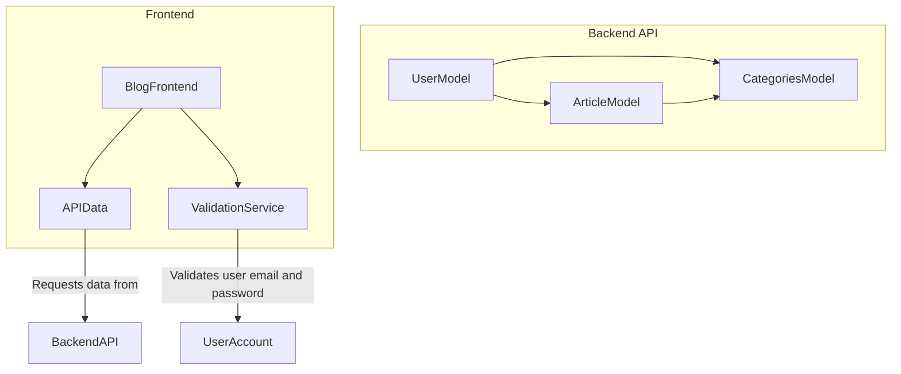

# Blog com Painel Administrativo

## ℹ Sobre
Projeto desenvolvido para disciplina de Sistemas Distribuídos, ministrada por Robson Medeiros.

Blog para publicação de artigos.

## Módulos

## 🛠 Tecnologias Utilizadas
- NodeJS
- Express
- Sequelize
- EJS
- TinyMCE
- FastAPI

## ☑ Funcionalidades

- [x] CRUDs 
  - [x] Categorias
  - [x] Artigos 
- [x] Criação de contas, login e logout
- [x] Validação de endereço de email e senha forte ao criar conta

## 🌐 Interface Web

## 👨‍💻 Como utilizar

É necessário ter o NodeJS instalado na sua máquina, além de um gerenciador de pacotes, como o npm ou yarn para executar o servidor.

Além disso, o banco de dados deve estar configurado e rodando no momento da execução.
